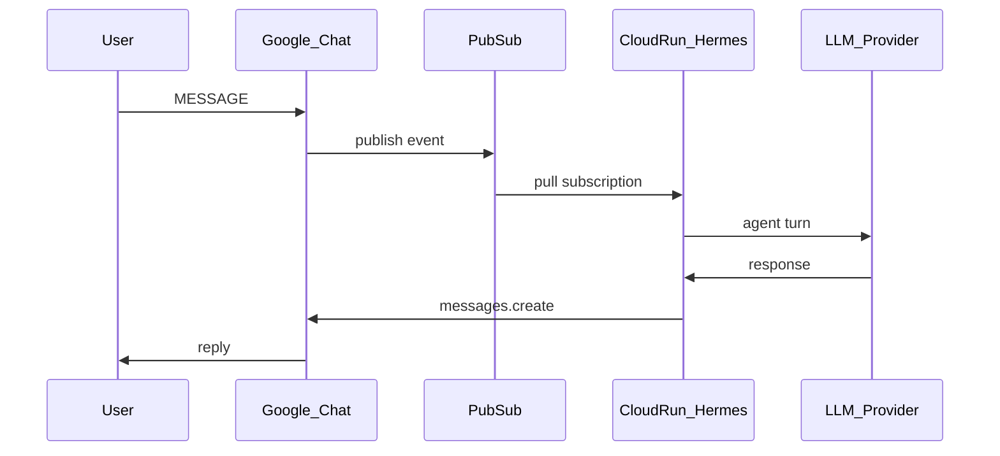

# Arkkitehtuuri

## Komponentit

| Komponentti | Teknologia | Rooli |
|-------------|------------|-------|
| Google Chat API | Workspace | UI, space/DM |
| Cloud Pub/Sub | GCP | Inbound event queue |
| Cloud Run | `hermes-gateway` | Hermes gateway (Pub/Sub pull) |
| Secret Manager | GCP | SA JSON, LLM-avaimet |
| GitHub Actions | WIF | Build + deploy |

## Event flow

## Miksi Pub/Sub (ei HTTP)

Moderate-repossa (`chat-moderation`) HTTP `/chat` aiheutti:

- Org policy estää `allUsers` → 403 ilman Apps Script -proxyä
- JWT audience -sekaannukset
- Scale-to-zero vs Chat long-poll

Hermes Google Chat -adapteri tukee **Pub/Sub pull** — ei julkista URL:ia, ei invoker-IAM inboundille.

## Cloud Run

- `min-instances=1` — Pub/Sub pull vaatii jatkuvan prosessin
- `HERMES_HOME=/opt/data` — persistent config (mount Secret + env)
- Runtime SA: `hermes-chat-bot@PROJECT.iam.gserviceaccount.com`

## Rajaukset

- **Ei** Zapier, Sheet-jono, HMAC-webhookeja
- **Ei** Apps Script -proxyä v1:ssä
- **Erillinen** Chat-app moderate-moderoinnista
